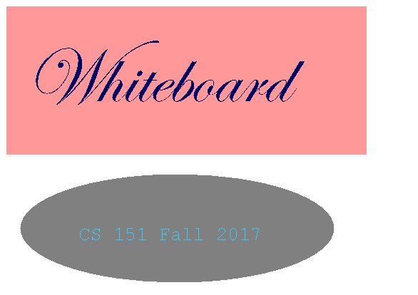

# Whiteboard
> Primitive but functional drawing application with networking capabilities

# Description
 Whiteboard application in Java with Swing GUI framework allows to draw multiple shapes (Rectangle, Oval, Line, Text), resize, drag and remove methods are supported. Networking features consist of a setting one instance to server mode and another instance to client mode. Server acts as a broadcaster while client receives all of the actions performed by server but can't make changes.    

## Known Bugs
* NONE ?!

## Usage

Click on the executable Whiteboard.jar

## Meta

Please feel free to reach out:)

Danil Kolesnikov – danil.kolesnikov@sjsu.edu

Distributed under the MIT license.
